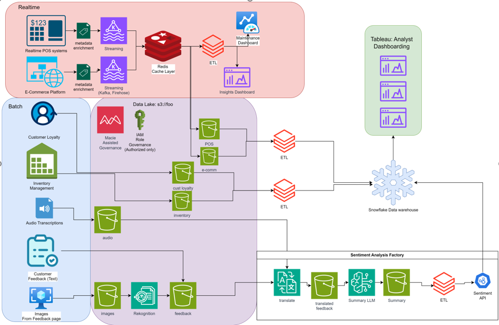

# Day 1

## Design Diagram
**Diagram Description**: The design below outlines the entire ETL process and data architecture from on prem to S3 and Snowflake.


# Day 2

**Sample Code** Completed an ETL using AWS Wrangler. 

Below is sample code used in my ETL
```python 
desc = "This the Taxi table for January, 2024."
param = {"source": "NYC Taxi Web Service https://www.nyc.gov", "class": "e-commerce"}
comments = {
    "tpep_pickup_datetime": "The date and time when the meter was engaged.",
    "PULocationID": "TLC Taxi Zone in which the taximeter was engaged",
    "payment_type": "A numeric code signifying how the passenger paid for the trip",
    "fare_amount": "The time-and-distance fare calculated by the meter.",
}

bucket = "techcatalyst-transformed-glue"

res = wr.s3.to_parquet(
    df=df,
    path=f"s3://{bucket}/<YOURNAME>/nyc/",
    dataset=True,
    database=<YOURDATABASE>,
    table=<YOURTABLE>,
    mode="overwrite",
    glue_table_settings=wr.typing.GlueTableSettings(description=desc, parameters=param, columns_comments=comments),
)
```
## Day 3

On day 3 I completed a case study where I researched multiple ML AWS services and then created possible data pipelines that use said services. Below shows the research and design diagram of the data pipeline.

### AWS Comprehend 

Uses ML to automatically identify language of text, extract key phrases, understand sentiment, and detect inappropriate content. 

Data Pipeline – Collect data from various sources like emails, reviews, social media posts, or other text data. Store text data in S3 and use AWS Lambda to trigger AWS Comprehend Tasks such as determining language of the text or sentiment analysis. Store the results in S3 or DynamoDB and use AWS Quicksight for visualizations or reporting. 

### AWS Transcribe 

Converts Speech into text. Can identify and differentiate between different speakers, supports multiple languages, allows for real time speech recognition. 

Store or stream customer service calls in s3. Then use AWS to convert the calls into text and use AWS Comprehend to analyze the sentiment, checking if the content is positive or negative. If negative sentiment is detected, then Use lambda or SNS to trigger notifications to managers. The results can be stored in DynamoDB or s3 for further analysis if needed. 

 

### AWS Rekognition 

If you upload an image to Amazon Rekognition, once a model performs facial analysis you will see a table containing phrases that describe the individual in the image as well as associated percentages representing how confident the model is about the statements/phrases that it has made using what it has detected  

Through this table, you can understand how the person is feeling as well as how they are displaying that emotion, what they are wearing by looking at the statements made by the model 

Usecase: Photos taken on the site of a car accident for example can be received by the insurance company and can be stored in an s3 bucket. From there, these images can be uploaded to AWS Rekognition, and the models that Reckognition utilizes can extract information from the images, output the information received from the images in the form of text which can then be stored in a structured database 

### AWS Textract  

You can upload a file like the copy of a driver’s license, a receipt or a record and the service can be used to… 

Extract values for important attributes about a person like their phone number, their address, their name, where they are from  

 extract import details about a transaction 

Extract all values and words from a document 

 
### AWS Macie 

Continually evaluates S3 environment and provides a summary of data security across all accounts 

One-time, daily, weekly, monthly sensitive data discovery jobs for a set of objects in an S3 bucket 

Also tracks changes overtime to evaluate new/modified objects 

Define custom data types via regex or use the list of pre-existing PII (Personally Identifiable Information) data types as defined in regulations like GDPR, PCI-DSS, HIPAA (Health Insurance Portability and Accountability Act) 

Can ignore certain patterns with allow lists – reduces false positives 

Supports multiple accounts; a single Macie Admin account can manage all member accounts  

In just a few clicks you can have PII data discovery enabled across the organization 

The use cases are self-explanatory. 

Macie could be especially useful for buckets with a lot of manual loading – it can watch the bucket for data that should not be there 

Likewise, if an org hosts public data, Macie could monitor it for data that shouldn’t be there 


# Day 4
On Day 4 I created a Data pipeline for A retail company that wants to improve its understanding of customer behavior and satisfaction by analyzing various data sources. These sources include transcribed audio from customer service calls, customer feedback texts, and images collected from the feedback page. 

**Diagram Description**: The design below outlines the entire data pipeline process and data architecture for the retail corp.
