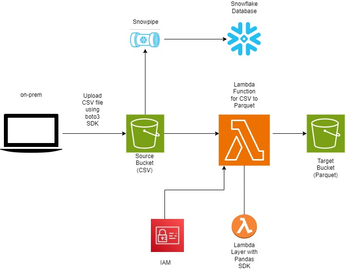

# Day 1

## Design Diagram
**Diagram Description**: The design below outlines the entire ETL process and data architecture from on prem to S3 and Snowflake.



# Day 2

Completed an ETL using AWS Wrangler. 

Below is sample code used in my ETL
```python 
desc = "This the Taxi table for January, 2024."
param = {"source": "NYC Taxi Web Service https://www.nyc.gov", "class": "e-commerce"}
comments = {
    "tpep_pickup_datetime": "The date and time when the meter was engaged.",
    "PULocationID": "TLC Taxi Zone in which the taximeter was engaged",
    "payment_type": "A numeric code signifying how the passenger paid for the trip",
    "fare_amount": "The time-and-distance fare calculated by the meter.",
}

bucket = "techcatalyst-transformed-glue"

res = wr.s3.to_parquet(
    df=df,
    path=f"s3://{bucket}/<YOURNAME>/nyc/",
    dataset=True,
    database=<YOURDATABASE>,
    table=<YOURTABLE>,
    mode="overwrite",
    glue_table_settings=wr.typing.GlueTableSettings(description=desc, parameters=param, columns_comments=comments),
)
```
